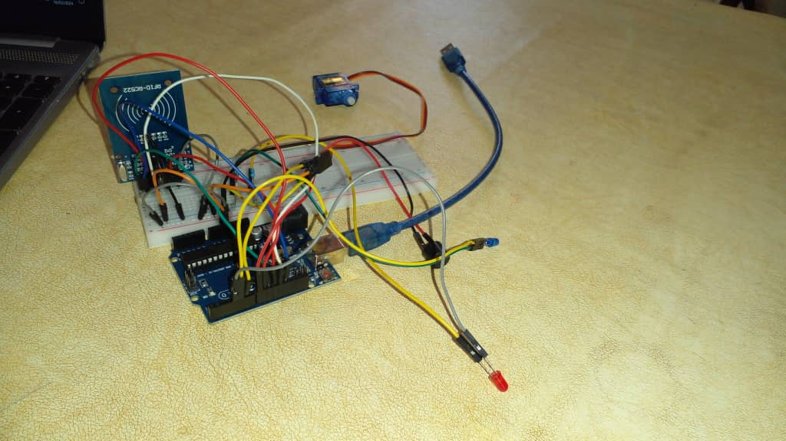

# Système Intelligent d'Accès Sécurisé par Badge

Ce projet vise à concevoir un système d'accès sécurisé par badge, capable de lire les numéros d'identification des badges et de les comparer à une base de données pour autoriser ou refuser l'accès en conséquence. De plus, il est équipé d'une fonctionnalité d'alarme déclenchée si un badge inconnu est présenté à plusieurs reprises, et il utilise maintenant deux LED, une rouge et une bleue, pour indiquer l'état de l'accès.

## Fonctionnalités clés

- **Lecture de Badges :** Le système est capable de lire les numéros d'identification des badges.
- **Vérification dans la Base de Données :** Les numéros lus sont comparés à une base de données pour autoriser ou refuser l'accès.
- **Gestion des Badges Inconnus :** Si un badge inconnu est présenté à plusieurs reprises, une alarme est déclenchée pendant 20 secondes.
- **Indication de l'État par LED :** Une LED rouge est allumée en cas d'accès refusé, tandis qu'une LED bleue est allumée en cas d'accès autorisé.

## Actions en fonction de l'Accès

- **Accès Autorisé :** Lorsqu'un badge autorisé est présenté, un servomoteur actionne l'ouverture de la porte. Après une pause, le servomoteur referme la porte.
- **Accès Refusé :** En cas de badge non autorisé, la porte reste fermée et aucune action n'est effectuée sur le servomoteur.

## Configuration

Assurez-vous d'avoir les éléments suivants pour installer et utiliser le système :

- Microcontrôleur compatible avec le lecteur de badges, les LED et le servomoteur.
- Base de données contenant les numéros d'identification des badges autorisés.
- Deux LED (rouge et bleue) pour indiquer l'état de l'accès.
- Servomoteur pour actionner l'ouverture et la fermeture de la porte.

## Installation

1. Clonez ce dépôt sur votre système.
2. Connectez le lecteur de badges, les LED, le servomoteur et configurez-les selon les spécifications du matériel.
3. Assurez-vous que la base de données est accessible et contient les numéros d'identification des badges autorisés.

## Utilisation

1. Lancez le programme sur le microcontrôleur.
2. Présentez un badge au lecteur.
3. Observez la réaction du système en fonction de l'autorisation ou du refus d'accès.
4. En cas d'alarme, prenez les mesures appropriées pour vérifier l'identité du visiteur.

## Avertissement

Ce système est conçu à des fins de démonstration et d'apprentissage. Assurez-vous de respecter les lois et réglementations locales concernant la sécurité et la confidentialité des données.

## Ressources Additionnelles

Pour voir une démonstration de ce système, consultez ma [chaîne YouTube](https://www.youtube.com/@VIDO-bv3ko).

---

Ce README fournit une vue d'ensemble des fonctionnalités, de l'installation et de l'utilisation du système d'accès sécurisé par badge. Pour des instructions détaillées sur la configuration et l'exécution, veuillez consulter la documentation fournie avec le code source.
